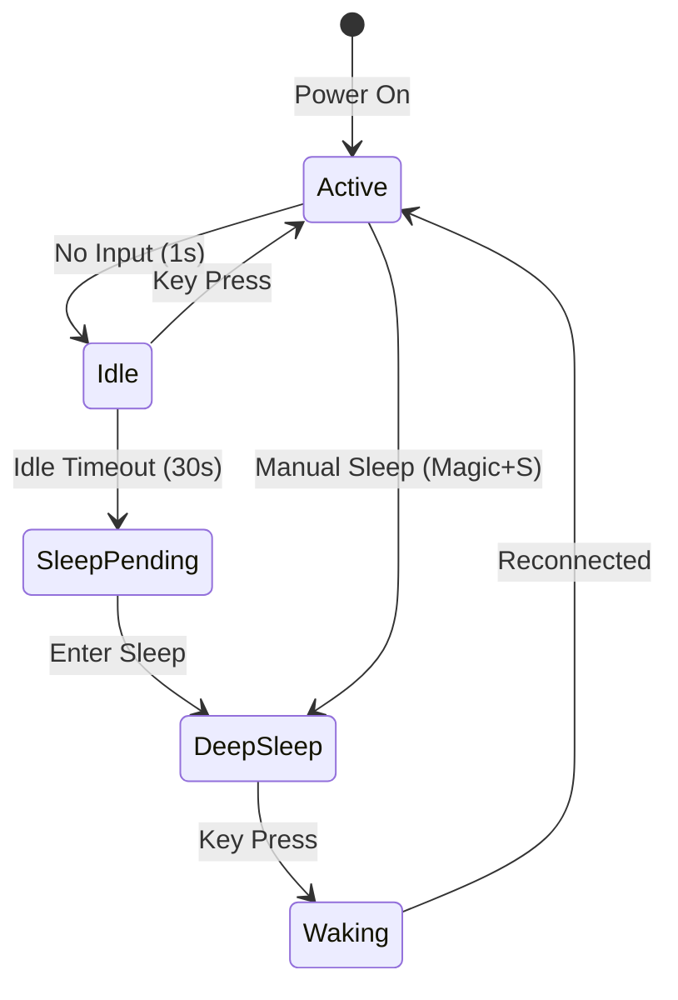
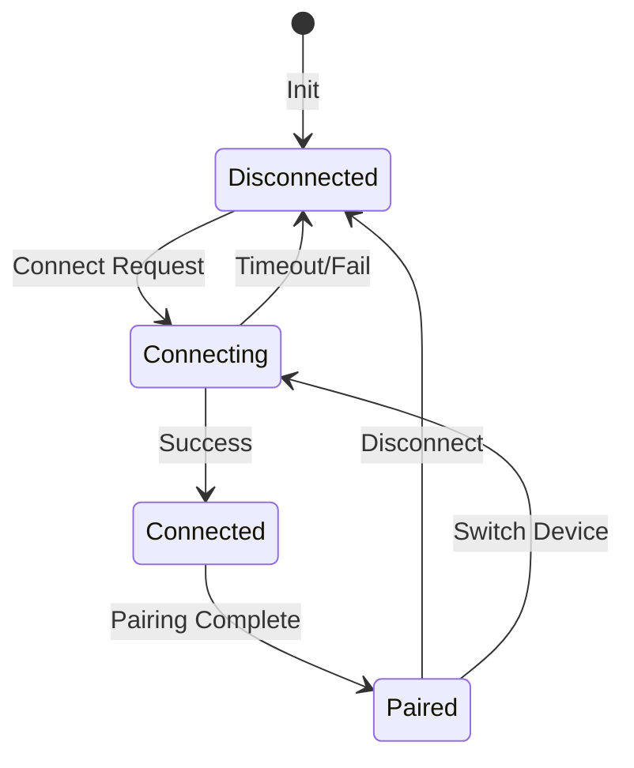
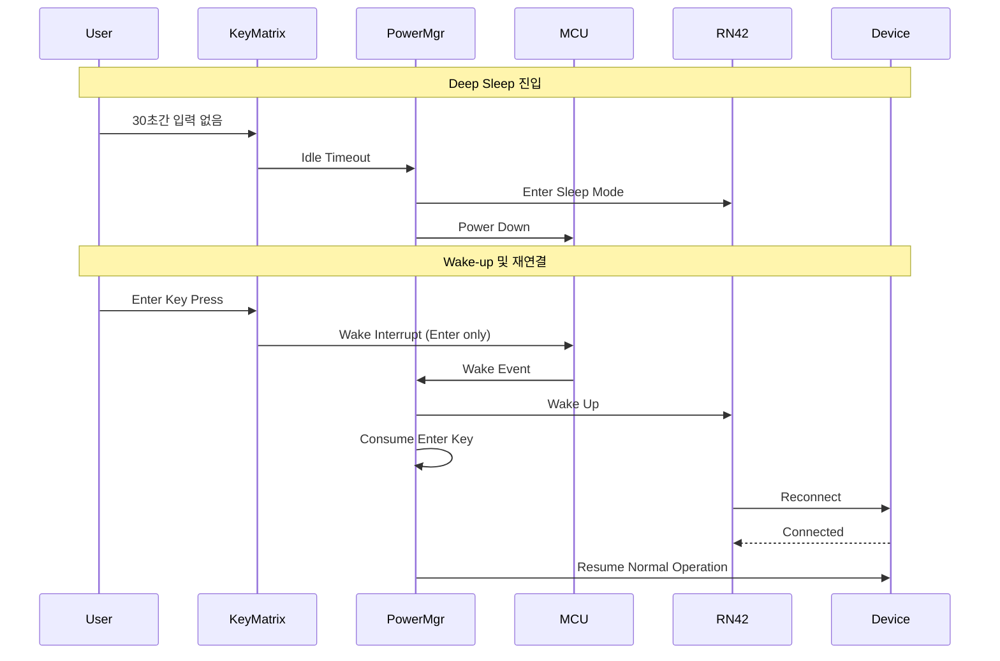
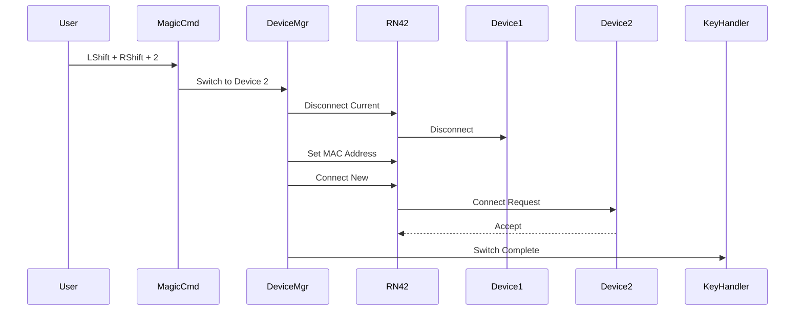

# 아키텍처 문서
## HHKB 블루투스 Deep Sleep 및 멀티 디바이스 페어링 시스템

### 문서 정보
- **버전**: 1.0
- **작성일**: 2025-01-17
- **프로젝트**: HHKB Professional Bluetooth Controller
- **아키텍처 유형**: Embedded System Architecture

---

## 1. 시스템 개요

### 1.1 아키텍처 목표
- **전력 효율성**: Deep Sleep 모드를 통한 배터리 수명 극대화
- **연결 유연성**: 4개 디바이스 간 빠른 전환 지원
- **안정성**: 연결 상태 유지 및 자동 복구
- **응답성**: 빠른 Wake-up 및 디바이스 전환

### 1.2 시스템 컨텍스트
```
┌─────────────────────────────────────────────────────────┐
│                    HHKB Bluetooth Controller            │
├─────────────────────────────────────────────────────────┤
│  ┌───────────────┐  ┌──────────────┐  ┌─────────────┐ │
│  │ ATmega32U4    │  │   RN-42      │  │   EEPROM    │ │
│  │ (MCU)         │←→│ (Bluetooth)  │  │ (Storage)   │ │
│  └───────────────┘  └──────────────┘  └─────────────┘ │
│         ↓                    ↓                          │
│  ┌───────────────┐  ┌──────────────┐                  │
│  │ Key Matrix    │  │ LED Driver   │                  │
│  └───────────────┘  └──────────────┘                  │
└─────────────────────────────────────────────────────────┘
                           ↓
         ┌─────────────────────────────────┐
         │     Paired Devices (1-4)        │
         │  • PC/Mac                       │
         │  • Tablet                       │
         │  • Smartphone                   │
         │  • Other                        │
         └─────────────────────────────────┘
```

---

## 2. 컴포넌트 아키텍처

### 2.1 레이어드 아키텍처
```
┌─────────────────────────────────────────────────┐
│               Application Layer                  │
│  ┌─────────────┐  ┌──────────────────────────┐ │
│  │ Key Mapping │  │ Command Processing       │ │
│  └─────────────┘  └──────────────────────────┘ │
├─────────────────────────────────────────────────┤
│              Service Layer                       │
│  ┌─────────────┐  ┌──────────────────────────┐ │
│  │Power Manager│  │ Multi-Device Manager     │ │
│  └─────────────┘  └──────────────────────────┘ │
├─────────────────────────────────────────────────┤
│               HAL Layer                          │
│  ┌─────────────┐  ┌──────────────────────────┐ │
│  │ MCU Driver  │  │ Bluetooth Driver         │ │
│  └─────────────┘  └──────────────────────────┘ │
├─────────────────────────────────────────────────┤
│              Hardware Layer                      │
│  ┌─────────────┐  ┌──────────────────────────┐ │
│  │ ATmega32U4  │  │ RN-42 Module            │ │
│  └─────────────┘  └──────────────────────────┘ │
└─────────────────────────────────────────────────┘
```

### 2.2 주요 컴포넌트

#### 2.2.1 Power Management Module
```c
// power_management.h
typedef struct {
    // 상태 관리
    power_state_t current_state;
    uint32_t idle_timer;
    bool wake_pending;
    
    // 설정
    deep_sleep_config_t config;
    
    // Magic Command 지원
    bool magic_command_enabled;
    
    // 콜백
    void (*on_sleep)(void);
    void (*on_wake)(void);
} power_manager_t;

// 상태 전이
typedef enum {
    POWER_STATE_ACTIVE,
    POWER_STATE_IDLE,
    POWER_STATE_SLEEP_PENDING,
    POWER_STATE_DEEP_SLEEP,
    POWER_STATE_WAKING
} power_state_t;
```

#### 2.2.2 Multi-Device Manager
```c
// multi_device.h
typedef struct {
    // 디바이스 관리
    multi_device_config_t config;
    uint8_t active_device;
    connection_state_t conn_states[4];
    
    // 연결 관리
    bool switching_in_progress;
    uint8_t reconnect_attempts;
    
    // 버퍼 관리
    wakeup_buffer_t key_buffer;
} device_manager_t;

// 연결 상태
typedef enum {
    CONN_STATE_DISCONNECTED,
    CONN_STATE_CONNECTING,
    CONN_STATE_CONNECTED,
    CONN_STATE_PAIRED
} connection_state_t;
```

---

## 3. 상태 다이어그램

### 3.1 전원 관리 상태


### 3.2 디바이스 연결 상태


---

## 4. 시퀀스 다이어그램

### 4.1 Deep Sleep 진입 및 Wake-up


### 4.2 멀티 디바이스 전환


---

## 5. 데이터 흐름

### 5.1 키 입력 처리 흐름
```
┌──────────┐    ┌────────────┐    ┌─────────────┐    ┌──────────┐
│Key Matrix│───→│Key Scanner │───→│Key Processor│───→│Key Buffer│
└──────────┘    └────────────┘    └─────────────┘    └──────────┘
                                          │                  │
                                          ↓                  ↓
                                  ┌─────────────┐    ┌──────────┐
                                  │Power Timer  │    │HID Report│
                                  │Reset        │    │Generator │
                                  └─────────────┘    └──────────┘
                                                            │
                                                            ↓
                                                      ┌──────────┐
                                                      │Bluetooth │
                                                      │Transmit  │
                                                      └──────────┘
```

### 5.2 전원 상태 관리 흐름
```
┌────────────┐    ┌─────────────┐    ┌──────────────┐
│Idle Timer  │───→│State Machine│───→│Power Control │
└────────────┘    └─────────────┘    └──────────────┘
      ↑                   │                    │
      │                   ↓                    ↓
┌────────────┐    ┌─────────────┐    ┌──────────────┐
│Key Activity│    │LED Control  │    │MCU Sleep Mode│
└────────────┘    └─────────────┘    └──────────────┘
      ↑
      │
┌────────────┐
│Magic Command│───→ Manual Sleep Trigger (Magic + S)
└────────────┘
```

---

## 6. 인터페이스 설계

### 6.1 Magic Command 통합

#### Magic Command 처리 흐름
```
┌───────────────┐    ┌───────────────┐    ┌───────────────┐
│ LShift+RShift │───→│Magic Command  │───→│ Command Extra │
│   Detection   │    │    Mode       │    │   Handler     │
└───────────────┘    └───────────────┘    └───────┬───────┘
                                                     │
        ┌────────────────────────┬───────────────┼───────────────┐
        │                        │               │               │
   ┌────┴─────┐  ┌──────────┴──┐  ┌───┴─────────┐  ┌──┴─────────┐
   │  S: Sleep │  │1-4: Device  │  │P: Pairing  │  │B: BT Status│
   └──────────┘  └─────────────┘  └────────────┘  └────────────┘
```

#### Magic Command 확장 구현
```c
// command_extra.c - Magic Command 확장
#include "power_management.h"
#include "multi_device.h"
#include "rn42.h"

void command_extra(uint8_t code) {
    static uint8_t sub_command = 0;
    
    switch (code) {
        // Deep Sleep 제어
        case MAGIC_KEY_SLEEP:
            power_mgr_enter_sleep(&power_manager);
            break;
            
        // 멀티 디바이스 전환
        case MAGIC_KEY_DEVICE_1:
        case MAGIC_KEY_DEVICE_2:
        case MAGIC_KEY_DEVICE_3:
        case MAGIC_KEY_DEVICE_4:
            if (sub_command == MAGIC_KEY_PAIR) {
                // Magic + P + 1/2/3/4: 특정 슬롯에 페어링
                device_mgr_pair_device(&device_manager, code - MAGIC_KEY_DEVICE_1);
            } else if (sub_command == MAGIC_KEY_DELETE) {
                // Magic + D + 1/2/3/4: 특정 슬롯 삭제
                device_mgr_delete_device(&device_manager, code - MAGIC_KEY_DEVICE_1);
            } else {
                // Magic + 1/2/3/4: 디바이스 전환
                device_mgr_switch_device(&device_manager, code - MAGIC_KEY_DEVICE_1);
            }
            sub_command = 0;
            break;
            
        // 페어링 모드
        case MAGIC_KEY_PAIR:
            sub_command = MAGIC_KEY_PAIR;
            device_mgr_pair_device(&device_manager, device_manager.active_device);
            break;
            
        // 페어링 삭제
        case MAGIC_KEY_DELETE:
            sub_command = MAGIC_KEY_DELETE;
            break;
            
        // 블루투스 상태
        case MAGIC_KEY_BT_STATUS:
            show_bluetooth_status();
            break;
            
        // Wake-up 전용 키
        case MAGIC_KEY_WAKE_ONLY:
            key_buffer.wake_only = true;
            break;
            
        default:
            sub_command = 0;
            break;
    }
}
```

### 6.2 모듈 간 인터페이스

#### Power Management API
```c
// 초기화 및 설정
void power_mgr_init(power_manager_t* mgr);
void power_mgr_configure(power_manager_t* mgr, deep_sleep_config_t* config);

// Magic Command 지원
bool power_mgr_is_magic_enabled(power_manager_t* mgr);
void power_mgr_set_magic_enabled(power_manager_t* mgr, bool enabled);

// 상태 제어
void power_mgr_reset_timer(power_manager_t* mgr);
void power_mgr_enter_sleep(power_manager_t* mgr);
void power_mgr_wake_up(power_manager_t* mgr);

// 상태 조회
power_state_t power_mgr_get_state(power_manager_t* mgr);
uint32_t power_mgr_get_idle_time(power_manager_t* mgr);
```

#### Multi-Device Manager API
```c
// 초기화 및 설정
void device_mgr_init(device_manager_t* mgr);
void device_mgr_load_config(device_manager_t* mgr);

// 디바이스 관리
bool device_mgr_pair_device(device_manager_t* mgr, uint8_t slot);
bool device_mgr_delete_device(device_manager_t* mgr, uint8_t slot);
bool device_mgr_switch_device(device_manager_t* mgr, uint8_t slot);

// 연결 관리
bool device_mgr_reconnect(device_manager_t* mgr);
void device_mgr_disconnect_current(device_manager_t* mgr);

// 상태 조회
uint8_t device_mgr_get_active_device(device_manager_t* mgr);
connection_state_t device_mgr_get_connection_state(device_manager_t* mgr, uint8_t slot);
```

### 6.3 RN-42 통신 프로토콜

#### 명령어 인터페이스
```c
// RN-42 명령어 래퍼
typedef struct {
    const char* command;
    uint16_t timeout_ms;
    const char* expected_response;
} rn42_command_t;

// 주요 명령어
const rn42_command_t RN42_SLEEP_CMDS[] = {
    {"SW,0320", 1000, "AOK"},      // Deep Sleep 타이머 설정
    {"S*,0320", 1000, "AOK"},      // Sniff 모드 설정
    {"SM,4", 1000, "AOK"},         // DTR 모드 (Auto-Connect 제어)
};

const rn42_command_t RN42_CONNECT_CMDS[] = {
    {"C,%s", 5000, "CONNECT"},     // MAC 주소로 연결
    {"K,", 1000, "DISCONNECT"},    // 연결 종료
    {"SR,%s", 1000, "AOK"},        // 원격 주소 설정
};
```

---

## 7. 메모리 레이아웃

### 7.1 EEPROM 구조
```
Address Range | Size | Content
--------------|------|---------------------------
0x0000-0x0003 | 4B   | Magic Number (0xDEADBEEF)
0x0004-0x0007 | 4B   | Version Info
0x0008-0x000F | 8B   | Deep Sleep Config
0x0010-0x0013 | 4B   | Active Device Index
0x0014-0x0017 | 4B   | Last Connected Timestamp
0x0020-0x005F | 64B  | Device 1 Info
0x0060-0x009F | 64B  | Device 2 Info
0x00A0-0x00DF | 64B  | Device 3 Info
0x00E0-0x011F | 64B  | Device 4 Info
0x0120-0x01FF | 224B | Reserved
```

### 7.2 RAM 사용량 추정
```
Component          | RAM Usage
-------------------|----------
Power Manager      | 32 bytes
Device Manager     | 48 bytes
Device Info (x4)   | 160 bytes
Key Buffer         | 32 bytes
Connection States  | 16 bytes
Misc Variables     | 24 bytes
-------------------|----------
Total              | ~312 bytes
```

---

## 8. 동시성 및 동기화

### 8.1 인터럽트 처리
```c
// 인터럽트 우선순위
#define INT_PRIORITY_WAKEUP     0  // 최고 우선순위
#define INT_PRIORITY_TIMER      1
#define INT_PRIORITY_UART       2
#define INT_PRIORITY_KEY_SCAN   3

// 크리티컬 섹션 보호
#define ENTER_CRITICAL() cli()
#define EXIT_CRITICAL()  sei()

// 원자적 연산
#define ATOMIC_BLOCK(type) \
    for(type, __ToDo = 1; __ToDo; __ToDo = 0)
```

### 8.2 타이머 관리
```c
// 타이머 설정
typedef struct {
    uint16_t prescaler;
    uint16_t compare_value;
    void (*callback)(void);
} timer_config_t;

// 멀티플렉싱된 타이머 사용
enum {
    TIMER_IDLE_MONITOR = 0,
    TIMER_LED_BLINK,
    TIMER_RECONNECT_TIMEOUT,
    TIMER_MAX
};
```

---

## 9. 오류 처리 및 복구

### 9.1 오류 감지
```c
typedef enum {
    ERROR_NONE = 0,
    ERROR_BT_TIMEOUT,
    ERROR_BT_CONNECTION_LOST,
    ERROR_EEPROM_CORRUPT,
    ERROR_INVALID_DEVICE_SLOT,
    ERROR_BUFFER_OVERFLOW
} error_code_t;

typedef struct {
    error_code_t code;
    uint32_t timestamp;
    uint8_t retry_count;
    void (*recovery_action)(void);
} error_context_t;
```

### 9.2 복구 전략
1. **연결 실패**: 3회 재시도 후 대기 모드
2. **EEPROM 오류**: 기본값으로 초기화
3. **버퍼 오버플로우**: 오래된 데이터 삭제
4. **Wake-up 실패**: 하드웨어 리셋

---

## 10. 성능 최적화

### 10.1 전력 최적화
- **클럭 게이팅**: 미사용 주변장치 비활성화
- **전압 스케일링**: Sleep 모드에서 저전압 동작
- **웨이크업 소스 최적화**: 필요한 인터럽트만 활성화

### 10.2 응답성 최적화
- **프리페치**: 자주 사용되는 디바이스 정보 캐싱
- **빠른 초기화**: Wake-up 시 최소한의 초기화
- **비동기 처리**: 블루투스 연결을 백그라운드에서 처리

---

## 11. 보안 고려사항

### 11.1 페어링 보안
- **PIN 코드**: 디바이스별 고유 PIN 설정 가능
- **암호화**: RN-42의 128-bit 암호화 사용
- **타임아웃**: 페어링 모드 자동 종료 (30초)

### 11.2 데이터 보호
- **EEPROM 체크섬**: 데이터 무결성 검증
- **키 버퍼 보안**: 민감한 키 입력 미저장

---

## 12. 확장성 고려사항

### 12.1 향후 확장 가능 영역
- **디바이스 슬롯 확장**: 현재 4개 → 최대 8개
- **프로파일 지원**: 디바이스별 커스텀 설정
- **OTA 업데이트**: 블루투스를 통한 펌웨어 업데이트

### 12.2 모듈화 설계
- **플러그인 아키텍처**: 새로운 기능 모듈 추가 용이
- **HAL 추상화**: 다른 블루투스 모듈로 교체 가능
- **설정 확장성**: JSON 기반 설정 구조 채택 가능

---

## 13. 의존성 관계

### 13.1 컴포넌트 의존성 그래프
```
┌─────────────────┐
│   Application   │
│     Layer       │
└────────┬────────┘
         │ depends on
┌────────▼────────┐     ┌──────────────┐
│ Power Manager   │────→│ Timer Service │
└────────┬────────┘     └──────────────┘
         │                      │
┌────────▼────────┐            │
│ Device Manager  │────────────┘
└────────┬────────┘
         │
┌────────▼────────┐     ┌──────────────┐
│  RN-42 Driver   │────→│ UART Driver  │
└─────────────────┘     └──────────────┘
```

### 13.2 빌드 의존성
```makefile
# 모듈별 의존성
power_management.o: power_management.c power_management.h config.h
multi_device.o: multi_device.c multi_device.h eeprom.h
rn42_driver.o: rn42_driver.c rn42_driver.h uart.h
main.o: main.c $(ALL_HEADERS)
```

---

## 14. 테스트 전략

### 14.1 단위 테스트
- **전원 상태 전이**: 모든 상태 전이 경로 검증
- **타이머 정확도**: ±1% 오차 범위 내 동작
- **버퍼 관리**: 오버플로우 및 언더플로우 방지

### 14.2 통합 테스트
- **시나리오 테스트**: 실제 사용 패턴 시뮬레이션
- **스트레스 테스트**: 연속 전환 및 재연결
- **전력 프로파일링**: 실제 전류 소비 측정

---

## 15. 문서 참조

### 15.1 관련 문서
- [PRD_DeepSleep_MultiDevice.md](PRD_DeepSleep_MultiDevice.md) - 제품 요구사항
- [CLAUDE.md](CLAUDE.md) - 프로젝트 개발 가이드
- [README.md](README.md) - HHKB 컨트롤러 개요
- [config.h](config.h) - Magic Command 설정 (IS_COMMAND)

### 15.2 외부 참조
- [TMK Core Documentation](../../tmk_core/doc/)
- [RN-42 Datasheet](http://ww1.microchip.com/downloads/en/DeviceDoc/rn-42-ds-v2.32r.pdf)
- [ATmega32U4 Reference Manual](http://ww1.microchip.com/downloads/en/DeviceDoc/Atmel-7766-8-bit-AVR-ATmega16U4-32U4_Datasheet.pdf)