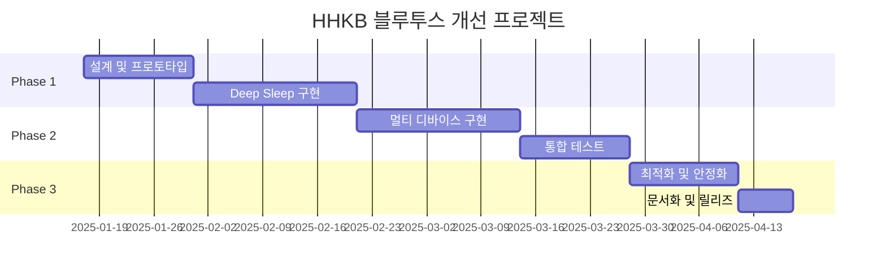

# 에픽 문서 (Epic Document)
## HHKB 블루투스 전력 최적화 및 멀티 디바이스 지원

### 에픽 정보
- **에픽 ID**: HHKB-EPIC-001
- **프로젝트**: HHKB Professional Bluetooth Controller Enhancement
- **시작일**: 2025-01-17
- **목표 완료일**: 2025-03-31
- **상태**: 진행 중
- **우선순위**: 높음
- **에픽 소유자**: 개발팀 리드

---

## 1. 에픽 개요

### 1.1 비전
HHKB 블루투스 키보드를 위한 혁신적인 전력 관리 시스템과 다중 디바이스 연결 기능을 구현하여, 사용자에게 최고의 무선 키보드 경험을 제공한다.

### 1.2 목표
- **전력 효율성**: 배터리 수명을 3개월 이상으로 연장
- **연결 유연성**: 최대 4개 디바이스 간 원활한 전환
- **사용자 경험**: 빠른 응답성과 안정적인 연결 유지
- **호환성**: 기존 HHKB 사용자를 위한 원활한 마이그레이션

### 1.3 성공 지표
- 전력 소비: Deep Sleep 모드에서 <50μA
- Wake-up 시간: <100ms
- 디바이스 전환 시간: <2초
- 사용자 만족도: 90% 이상

---

## 2. 범위 정의

### 2.1 포함 사항
- **Deep Sleep 모드 구현**
  - 자동 Sleep 진입 (30초 무입력)
  - Enter 키 전용 Wake-up
  - 전력 소비 최적화
  
- **멀티 디바이스 페어링**
  - 4개 디바이스 저장 및 관리
  - Magic Command 기반 전환
  - LED 상태 표시
  
- **자동 재연결**
  - Wake-up 후 자동 연결
  - 연결 실패 시 재시도
  - Auto-Connect 충돌 방지

### 2.2 제외 사항
- OTA 펌웨어 업데이트
- 배터리 잔량 표시
- 커스텀 LED 애니메이션
- 5개 이상 디바이스 지원

---

## 3. 이해관계자

### 3.1 주요 이해관계자
| 역할 | 담당자 | 책임 |
|------|--------|------|
| 제품 관리자 | TBD | 요구사항 정의, 우선순위 결정 |
| 개발팀 리드 | TBD | 기술 설계, 구현 감독 |
| QA 리드 | TBD | 테스트 전략, 품질 보증 |
| UX 디자이너 | TBD | 사용자 경험 설계 |
| 기술 문서 작성자 | TBD | 문서화 |

### 3.2 사용자 그룹
- **파워 유저**: 멀티 디바이스 환경에서 작업
- **모바일 사용자**: 배터리 수명 중시
- **개발자**: 안정성과 커스터마이징 중요
- **일반 사용자**: 간단한 설정과 사용

---

## 4. 기술 아키텍처

### 4.1 주요 컴포넌트
```
┌─────────────────────────────────────────┐
│           Application Layer              │
│  ┌─────────────┐  ┌─────────────────┐  │
│  │Power Manager│  │Device Manager   │  │
│  └─────────────┘  └─────────────────┘  │
├─────────────────────────────────────────┤
│           Hardware Layer                 │
│  ┌─────────────┐  ┌─────────────────┐  │
│  │ ATmega32U4  │  │ RN-42 Module    │  │
│  └─────────────┘  └─────────────────┘  │
└─────────────────────────────────────────┘
```

### 4.2 기술 스택
- **MCU**: ATmega32U4
- **Bluetooth**: RN-42 모듈
- **Framework**: TMK Keyboard Firmware
- **개발 언어**: C
- **빌드 시스템**: GNU Make

---

## 5. 타임라인

### 5.1 주요 마일스톤


### 5.2 스프린트 계획
- **Sprint 1-2**: 설계 및 프로토타입
- **Sprint 3-4**: Deep Sleep 기본 기능
- **Sprint 5-6**: 멀티 디바이스 구현
- **Sprint 7**: 통합 및 테스트
- **Sprint 8**: 최적화 및 릴리즈

---

## 6. 리스크 관리

### 6.1 기술적 리스크
| 리스크 | 영향도 | 확률 | 대응 방안 |
|--------|--------|------|----------|
| RN-42 펌웨어 호환성 | 높음 | 중간 | 다양한 버전 테스트, 대체 모듈 검토 |
| 전력 목표 미달성 | 높음 | 중간 | 단계적 최적화, 하드웨어 개선 |
| 메모리 부족 | 중간 | 낮음 | 코드 최적화, 기능 우선순위 조정 |
| Wake-up 지연 | 중간 | 중간 | 인터럽트 최적화, 초기화 간소화 |

### 6.2 비즈니스 리스크
| 리스크 | 영향도 | 확률 | 대응 방안 |
|--------|--------|------|----------|
| 사용자 학습 곡선 | 중간 | 높음 | 직관적 UI, 상세한 매뉴얼 |
| 경쟁 제품 출시 | 중간 | 중간 | 차별화 기능 강화, 빠른 출시 |
| 호환성 문제 | 높음 | 낮음 | 광범위한 디바이스 테스트 |

---

## 7. 의존성

### 7.1 기술 의존성
- TMK Core 프레임워크 안정성
- RN-42 모듈 공급 및 지원
- ATmega32U4 개발 도구체인
- 테스트 디바이스 (PC, Mac, 태블릿, 스마트폰)

### 7.2 팀 의존성
- UX 팀: 사용자 인터페이스 설계
- QA 팀: 테스트 환경 구축
- 문서 팀: 사용자 매뉴얼 작성
- 마케팅 팀: 출시 전략

---

## 8. 승인 및 사인오프

### 8.1 승인 기준
- [ ] 모든 필수 기능 구현 완료
- [ ] 성능 목표 달성
- [ ] 품질 기준 충족
- [ ] 문서화 완료
- [ ] 이해관계자 승인

### 8.2 승인자
| 역할 | 이름 | 서명 | 날짜 |
|------|------|------|------|
| 제품 관리자 | | | |
| 개발팀 리드 | | | |
| QA 리드 | | | |
| 프로젝트 매니저 | | | |

---

## 9. 참고 문서
- [PRD_DeepSleep_MultiDevice.md](PRD_DeepSleep_MultiDevice.md)
- [Architecture_DeepSleep_MultiDevice.md](Architecture_DeepSleep_MultiDevice.md)
- [TMK Documentation](https://github.com/tmk/tmk_keyboard/wiki)
- [RN-42 Datasheet](http://ww1.microchip.com/downloads/en/DeviceDoc/rn-42-ds-v2.32r.pdf)